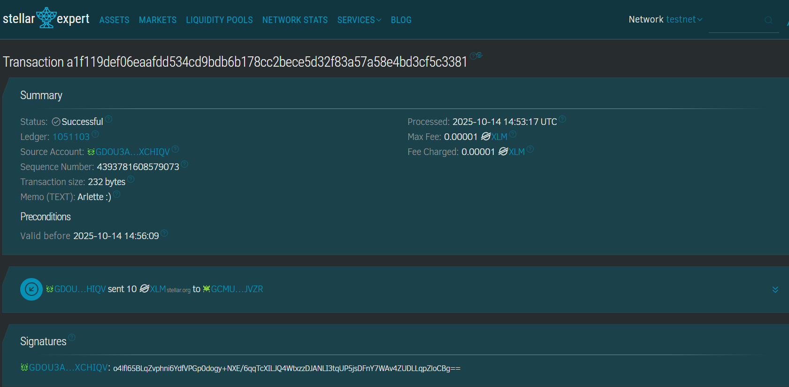
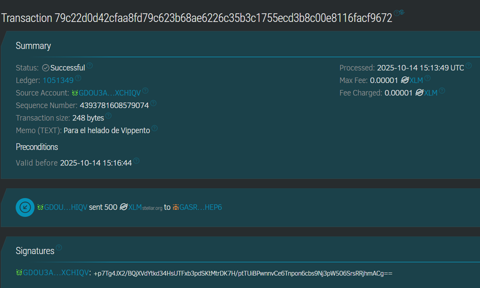

# 🪐 TAREA #1: MI VIAJE EN STELLAR

**Nombre:** Mariana Jobse
**Email:** [jobse.mariana@gmail.com](mailto:jobse.mariana@gmail.com)
**UserName de Telegram:** [@Marianavero](https://t.me/Marianavero)
**Tu wallet Freighter:** `GDOU3AWNJFQDLVAKT6UL57MQ473DGROEEENBW4VWGHGE34VHYXXCHIQV`

---

## 🧩 PARTE 1: PRÁCTICA TÉCNICA

### 🔹 TRANSACCIÓN A: Una compañera del equipo de 4

**Cuenta Original:** `GCMUDHTX6GGWTWECJ2QUAK4FARS2SAJVQQGKA7OTNN2I4VZ24MDCJVZR`
**Cuenta de la compañera:** Arlette Salas
**Transaction Hash:** `a1f119def06eaafdd534cd9bdb6b178cc2bece5d32f83a57a58e4bd3cf5c3381`

📷 **Imagen 1:**

---

### 🔹 TRANSACCIÓN B: Envío con Memo Personalizado

**Cuenta 1:** `GCMUDHTX6GGWTWECJ2QUAK4FARS2SAJVQQGKA7OTNN2I4VZ24MDCJVZR`
**Cuenta 2:** `GBKZ64TZYWBYUSWVFYSVAAWTQXVE7H2ZGN3UNRK3P247NGJDZXFDZSHA`
**Transaction Hash:** `79c22d0d42cfaa8fd79c623b68ae6226c35b3c1755ecd3b8c00e8116facf9672`
**Memo (TEXT):** “Para el helado de Vippento”

📷 **Imagen 2:**

---

## 💡 PARTE 2: INVESTIGACIÓN CREATIVA

### ✏️ RELATO: _“Stellar en Mi Mundo”_

Alquilo el departamento de mi amigo en La Plata. Él se encuentra viviendo en Barcelona y le pago mensualmente el alquiler a través de **Western Union**.
De los **500.000 ARS** del alquiler, tengo un **5% de comisión**, entonces tengo que calcular cuánto mandarle para que le lleguen netos 500.000.
Lo tengo automatizado, pero no es nada automático 😅.
Con **Stellar**, no habría que mandar más dinero porque la comisión es **insignificante**.

---

## 🌍 PARTE 3: REFLEXIÓN COMUNITARIA

En **Argentina**, muchas personas que trabajan en la economía informal —como vendedores ambulantes o trabajadores independientes— no tienen acceso a una cuenta bancaria ni pueden recibir pagos digitales fácilmente.
Esto limita sus oportunidades y los deja fuera del sistema financiero formal.

**Stellar** podría ayudar a reducir esta exclusión mediante su red de **pagos rápidos, seguros y de bajo costo**, permitiendo que cualquiera con un celular pueda crear una billetera digital y recibir pagos en segundos, incluso sin banco.

Además, las **comisiones mínimas** de Stellar hacen viables los **micropagos**, favoreciendo transacciones diarias de bajo valor.

Con **stablecoins** ancladas al peso o al dólar, las personas podrían resguardar su dinero sin perder valor por la inflación, facilitando el ahorro y la **inclusión financiera real** en comunidades que hoy dependen casi exclusivamente del efectivo.
